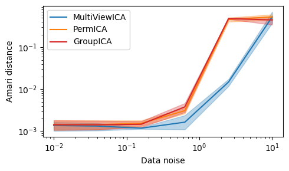
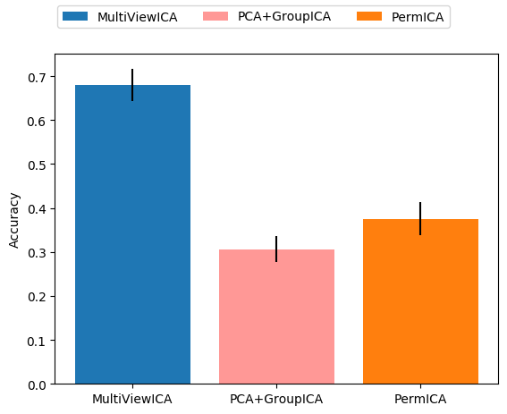

# MultiView ICA

[](https://circleci.com/gh/hugorichard/multiviewica)

Code accompanying the paper MultiViewICA https://arxiv.org/pdf/2006.06635.pdf

## Install

Clone the repository

`git clone https://github.com/hugorichard/multiviewica.git`

Move into the multiviewica directory

``cd multiviewica``

Install MultiView ICA

`pip install -e .`


## Requirements
For the core algorithms:
* numpy >= 1.16
* scipy >= 1.12
* scikit-learn >= 0.20
* python-picard >= 0.4 (``pip install python-picard``)

For the Experiments:
* nibabel (>=2.3.3)
* mne (>=0.20)
* nilearn (>=0.5)
* fastsrm (``pip install fastsrm``)

## Experiments

### Synthetic experiment

Move into the multiviewica directory

``cd multiviewica``

Run the experiment on synthetic data

`python examples/synthetic_experiment.py`



In order to reproduce the figure in the paper, use (might take a long time):
```
# sigmas: data noise
# m: number of subjects
# k: number of components
# n: number of samples
sigmas = np.logspace(-2, 1, 21)
n_seeds = 100
m, k, n = 10, 15, 1000
```

### Experiments on fMRI data

#### Download and mask Sherlock data

Move into the data directory

``cd multiviewica/data``

Launch the download script (Runtime ``34m6.751s``)

`` bash download_data.sh ``

Mask the data (Runtime ``15m27.104s``)

``python mask_data.py``

#### Reconstructing BOLD signal of missing subjects

Move into the `real_data_experiments` directory

``cd multiviewica/real_data_experiments``

Run the experiment on masked data (Runtime ``30m55.347s``)

``python reconstruction_experiment.py``


This runs the experiment with ``n_components = 5`` and benchmark ``PCA + GroupICA``,  ``PermICA`` and ``MultiView ICA`` with subject specific PCA for dimension reduction in ``PCA + GroupICA`` and SRM for ``PermICA`` and ``MultiView ICA``.

#### Timesegment matching

Move into the `real_data_experiment` directory

``cd multiviewica/real_data_experiments``

Run the experiment on masked data (Runtime ``17m39.520s``)

``python timesegment_matching.py``



This runs the experiment with ``n_components = 5`` and benchmark ``PCA + GroupICA``,  ``PermICA`` and ``MultiView ICA`` with subject specific PCA for dimension reduction in ``PCA + GroupICA`` and SRM for ``PermICA`` and ``MultiView ICA``.
