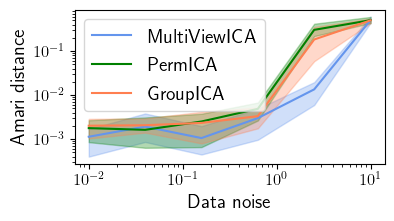

# MultiView ICA

## Install

Clone the repository

`git clone https://github.com/hugorichard/multiviewica.git`

Create a virual environment

`virtualenv -p python3 venv`


Activate the virtual environment

`source venv/bin/activate`

Move into the MultiView ICA directory

``cd multiviewica``

Install MultiView ICA

`pip install -e .`

## Experiments

### Synthetic experiment

Install MultiView ICA (see Install)

Move into the examples directory

``cd multiviewica/examples``

Run the experiment on synthetic data

`python synthetic_experiment.py`

It runs in `4min 28s` and creates a figure `synthetic_experiment.png`:



By default the experiment is run with
```
# sigmas: data noise
sigmas = np.logspace(-2, 1, 6)
n_seeds = 10
# m: number of subjects
# k: number of components
# n: number of samples
m, k, n = 10, 3, 1000
```

The figure in the paper is obtained with
```
# sigmas: data noise
sigmas = np.logspace(-2, 1, 10)
n_seeds = 100
# m: number of subjects
# k: number of components
# n: number of samples
m, k, n = 10, 15, 1000
```
These parameters are defined in `synthetic_experiment.py`.
